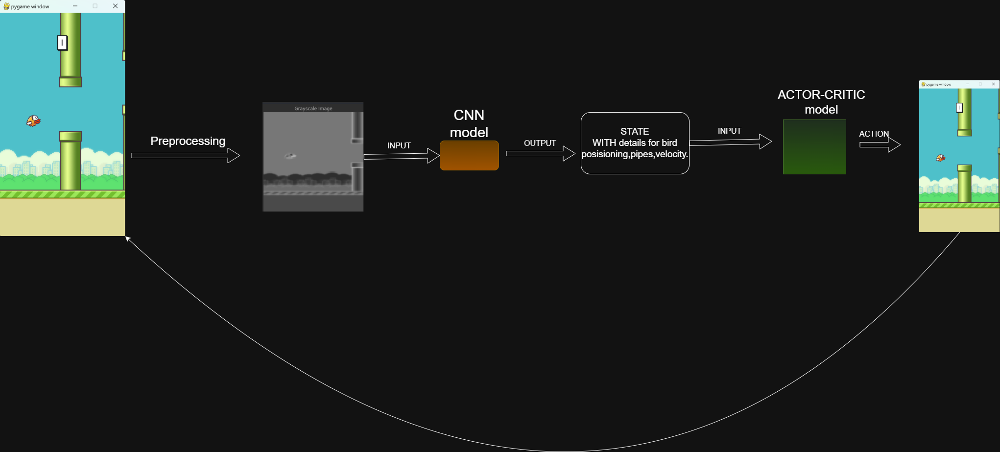

## Resources
### On-Policy vs Off-Policy
-https://www.geeksforgeeks.org/on-policy-vs-off-policy-methods-reinforcement-learning/
### CNN
-https://towardsdatascience.com/a-comprehensive-guide-to-convolutional-neural-networks-the-eli5-way-3bd2b1164a53
-https://www.datacamp.com/tutorial/introduction-to-convolutional-neural-networks-cnns
-https://medium.com/analytics-vidhya/understanding-convolution-operations-in-cnn-1914045816d4
-https://towardsdatascience.com/exploring-feature-extraction-with-cnns-345125cefc9a
### Actor-Critic
-https://www.geeksforgeeks.org/actor-critic-algorithm-in-reinforcement-learning/

# CNN Architecture and Training Details  

## Preprocessing/Normalization  
The preprocessing steps applied to the input images are as follows:  
1. **Conversion to PIL Image**: `transforms.ToPILImage()`  
2. **Grayscale Conversion**: `transforms.Grayscale(num_output_channels=1)`  
3. **Resizing**: `transforms.Resize((84, 84))`  
4. **Conversion to Tensor**: `transforms.ToTensor()`  

---

## CNN Architecture  
The CNN architecture is defined as follows:  

### **Layers**  
1. **First Convolutional Layer**:  
   - Input Channels: 1 (grayscale image)  
   - Output Channels: 8  
   - Kernel Size: 5x5  
   - Stride: 1  
   - Padding: 0  
2. **First Max Pooling Layer**:  
   - Kernel Size: 2x2  
   - Stride: 2  
3. **Second Convolutional Layer**:  
   - Input Channels: 8  
   - Output Channels: 16  
   - Kernel Size: 5x5  
   - Stride: 1  
   - Padding: 0  
4. **Second Max Pooling Layer**:  
   - Kernel Size: 2x2  
   - Stride: 2  
5. **Third Convolutional Layer**:  
   - Input Channels: 16  
   - Output Channels: 32  
   - Kernel Size: 5x5  
   - Stride: 1  
   - Padding: 0  
6. **Third Max Pooling Layer**:  
   - Kernel Size: 2x2  
   - Stride: 2  
7. **Fully Connected Layer**:  
   - Input Features: 32 * 7 * 7 (after three 2x2 poolings)  
   - Output Features: 12 (number of classes, represents state for Q-Learning input)  

---

## Hyperparameters  

### **Q-Learning Hyperparameters**  
- **Learning Rate (alpha)**: 0.1  
- **Discount Factor (gamma)**: 0.99  
- **Exploration Rate (epsilon)**: 1.0  
- **Exploration Decay (epsilon_decay)**: 0.995  
- **Number of Episodes (num_episodes)**: 100  

### **CNN Training Hyperparameters**  
- **Learning Rate**: 0.001  
- **Batch Size**: 64  
- **Number of Epochs**: 10  

---

# Neural Network Architecture Documentation  

## Actor Network  
The **Actor Network** is responsible for selecting actions based on the current state. It is a feedforward neural network with two hidden layers.  

### **Input**  
- **State dimension (`state_dim`)**: 12 features.  

### **Layers**  
1. **Input Layer**:  
   - `nn.Linear(state_dim, 128)` - Linear layer with 128 neurons.  
   - `nn.ReLU()` - ReLU activation function.  
2. **Hidden Layer**:  
   - `nn.Linear(128, 128)` - Linear layer with 128 neurons.  
   - `nn.ReLU()` - ReLU activation function.  
3. **Output Layer**:  
   - `nn.Linear(128, action_dim)` - Linear layer producing probabilities for actions.  
   - `nn.Softmax(dim=-1)` - Softmax activation to compute probabilities for actions.  

### **Output**  
- **Action probabilities (`action_dim`)**: 2 possible actions (`flap` or `no flap`).  

---

## Critic Network  
The **Critic Network** is responsible for evaluating the value of a given state. It is also a feedforward neural network with two hidden layers.  

### **Input**  
- **State dimension (`state_dim`)**: 12 features.  

### **Layers**  
1. **Input Layer**:  
   - `nn.Linear(state_dim, 128)` - Linear layer with 128 neurons.  
   - `nn.ReLU()` - ReLU activation function.  
2. **Hidden Layer**:  
   - `nn.Linear(128, 128)` - Linear layer with 128 neurons.  
   - `nn.ReLU()` - ReLU activation function.  
3. **Output Layer**:  
   - `nn.Linear(128, 1)` - Linear layer producing a scalar value representing the state's value.  

### **Output**  
- **Scalar value of the state**.  

---

## Initialization  
- **State dimension (`state_dim`)**: 12 features.  
- **Action dimension (`action_dim`)**: 2 actions (`flap` or `no flap`).  

---

## Optimizers  
- **Actor Network**: Adam optimizer with a learning rate of `1e-4`.  
- **Critic Network**: Adam optimizer with a learning rate of `1e-3`.  
